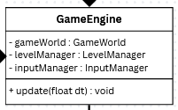
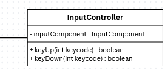
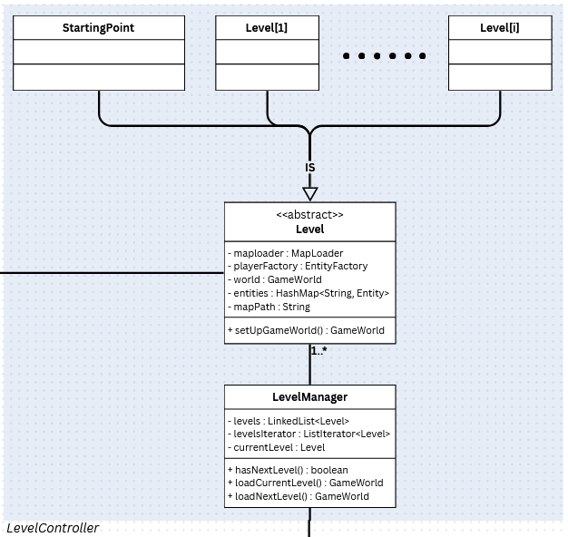

<h2>Game engine for Platformer</h2>

\> [Home](../../../README.md)

\> Previous : [*View*](./view.md)

### Architecture : *Controller*

#### The game engine class, a manager of managers

The controller part allows us to maintain a bridge between the model and the view.
The GameEngine class is based on the mediator design pattern to manage the managers.

Thanks to this class, we can control every event easily because all logic is separated.

#### The input controller

Here you can find the input manager; with this class, the player can move their character.

#### The level controller

The Level manager will generate the right map when the player finishes a level. The idea is to have a clean structure for every level and a clean render on the screen for the player experience.
We chose the iterator design pattern because it keeps a level order and will generate a new GameWorld until the player finishes the game while waiting for them.

How to configure a level? We use the template method for the abstract class `Level`. Afterward, any user can add many levels in the concreteLevel folder, organize them as they want, add any entities, etc.

It is a really powerful idea because for the time being we just have a linked list, but in the future if someone wants to organize their game with a tree or graph representation for levels, it could be done thanks to the iterator system.

 

\> Next : [*Overall UML*](./overall_uml.md)
