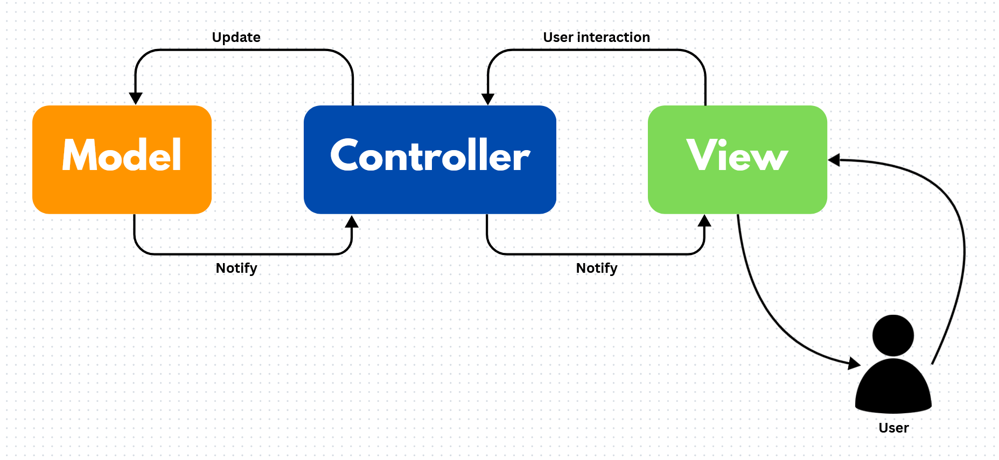

<h2>Game engine for Platformer</h2>

\> [Home](../../../README.md)

### Architecture : *General Structure*

 

> MVC Architecture 

In this section we will discuss the structure of the game engine. We used a MVC architecture :  

- M for model
- V for view
- C for controller

This is a useful idea to separate each logic, and scale the project rapidly.  

 

> How does it work ?  

Imagine the following situation :  
*"A game with a player and 2 ennemies on a map"*.  
How could we display this ? How could we control the player ? Does the ennemies move ?

-> A clean issue to this problem is literally : *build an engine*.  

Then we decided to separate each logic :
- The model part, related to data containers : entities, components, game world, ...
- The view part, to render every element of our game at a precise moment
- The controller part, to manage every interaction between the view and the model.

  

A FINIR !!!!!!!!!!!!!!!!!!!!!!!!!!!!!!!!!!!!!!!!!!!!!!!!!!!!!!!!!!!!

In the next steps we will discuss the choices for the models, the view and the controllers.

\> Next : [*Model*](./model.md)