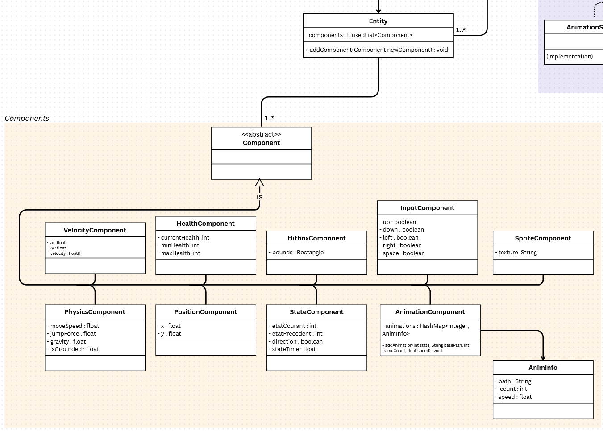
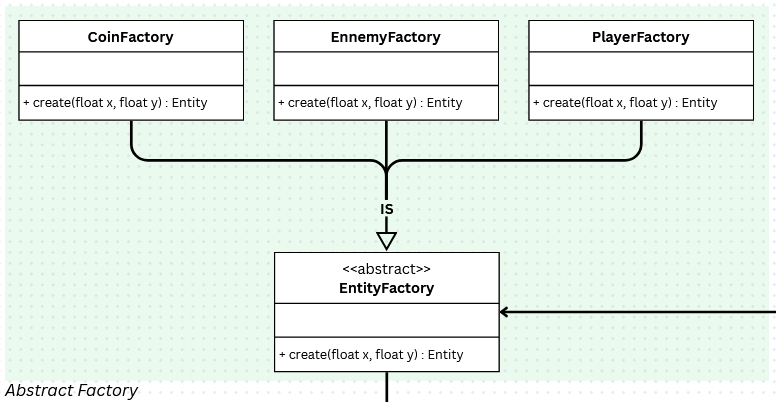
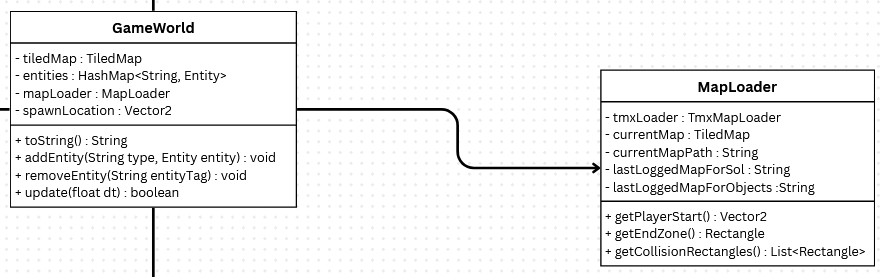
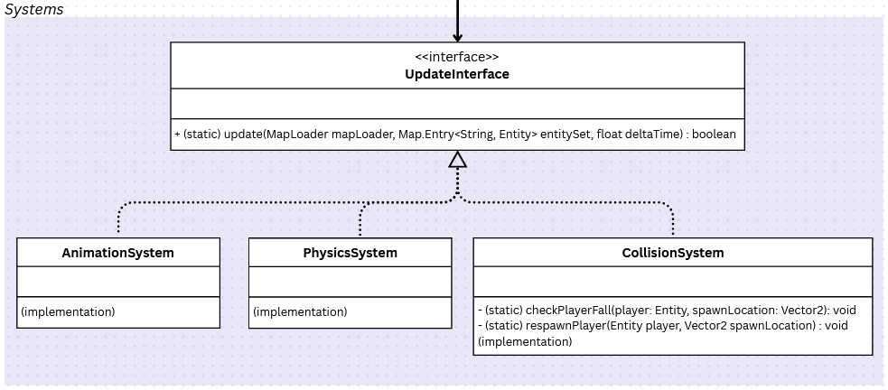

<h2>Game engine for Platformer</h2>

\> [Home](../../../README.md)

\> Previous : [*General Structure*](./general_structure.md)

### Architecture : *Model*

Let's explore a world to understand how to scale the project!

#### Entity / Components

In a game, there exist different kinds of objects: we can have players, enemies, items, obstacles, etc.
However, these objects are totally different sometimes—for instance, a player is not an item.
As you can see, we can have various objects in a game world, so we decided to cover all the possibilities of objects with a simple data container template.
Then the question is: how to organize all of this data in a simple template?

In a world, objects are entities, but they have several differences. For example, a player can jump, has a hitbox, etc. But a coin (for instance) cannot jump.

This idea is useful to:
- easily customize our entities,
- maintain without conflicts every data needed,
- avoid subclass exponentiation,
- cover all possible entity characteristics,
- add new components (if it's necessary).

So, every entity can have one or many components useful for the game engine.

#### How to create entities?

Now we need a player in our world. We use the abstract factory design pattern to help the user in the creation of entities. In this space, the user can easily customize the different entities of their own game.

#### The GameWorld

Now we want to save all of these entities in a world class named GameWorld.
This class is linked to the MapLoader class in order to import the Tiled map.
(The entities are saved in a HashMap for better performance).

#### How to update the data?

The important point here is to update all the entities and all the components.

For this kind of problem, we use the strategy pattern. It helps us to organize all the systems in order to synchronize the update at the right moment.
Then it will update the data of all the entities in our world.

 
 

\> Next : [*View*](./view.md)
