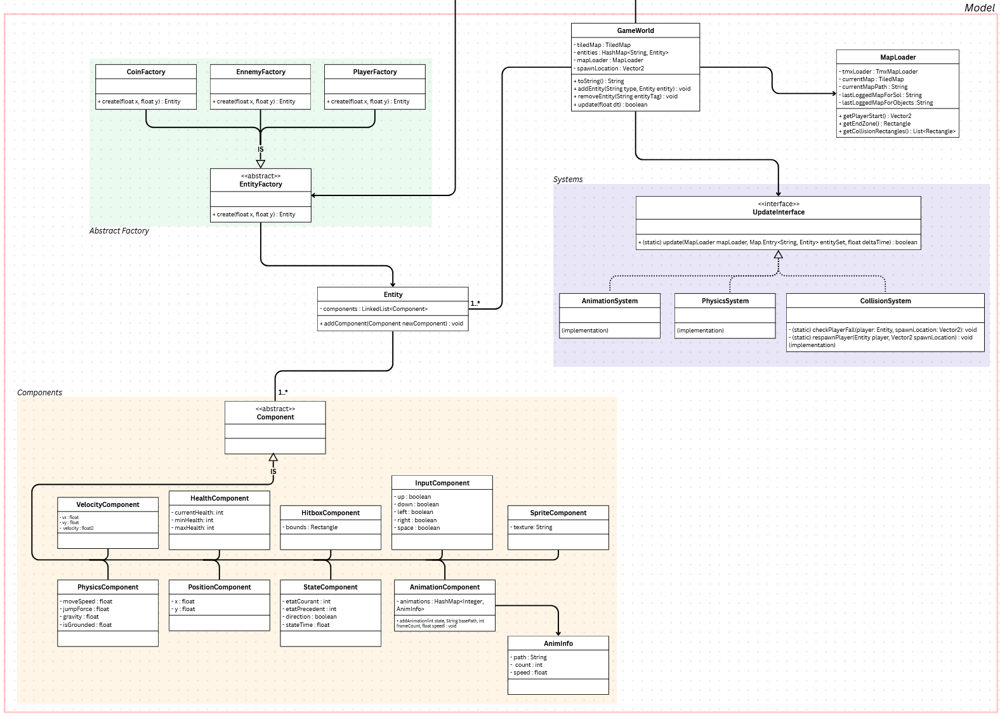
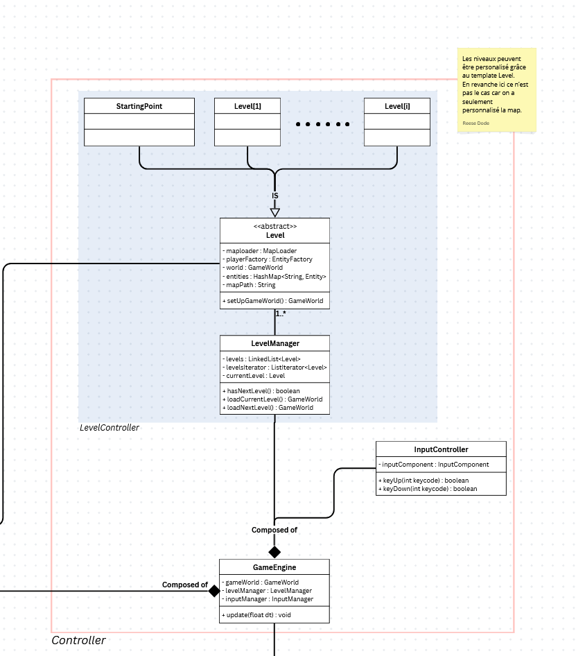
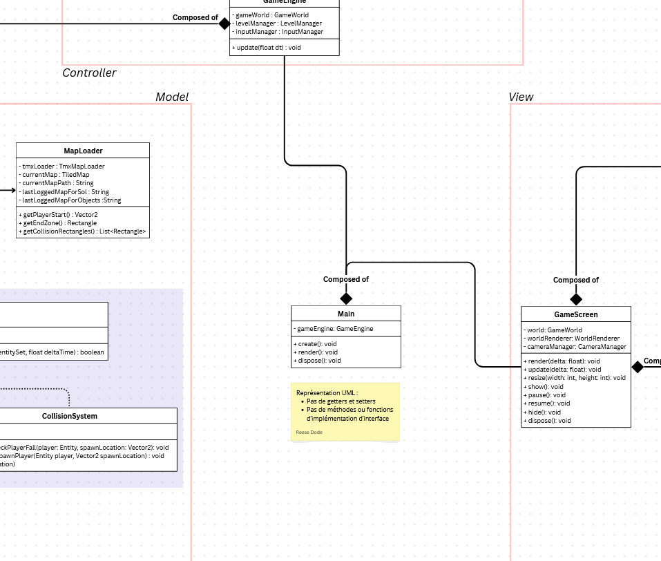

<h2>Game engine for Platformer</h2>

\> [Home](../../../README.md)

\> Previous : [*Controller*](./controller.md)

### Architecture : *Overall UML*

 
 

#### Overall UML: [click here to see the interactive UML *](https://www.canva.com/design/DAG-Nd3q5AI/7-SBKxmsaA3JwQnLGgQG0w/edit?utm_content=DAG-Nd3q5AI&utm_campaign=designshare&utm_medium=link2&utm_source=sharebutton)

 

 
 

> **Model**

 
 

> **View**

 
 

> **Controller**

 
 

> **Main**

 
 

\* If links have any problems :

-> Overall UML: https://www.canva.com/design/DAG-Nd3q5AI/7-SBKxmsaA3JwQnLGgQG0w/edit?utm_content=DAG-Nd3q5AI&utm_campaign=designshare&utm_medium=link2&utm_source=sharebutton

\> Next : [*End*](../../../README.md)
