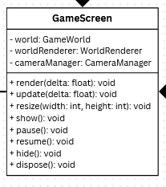
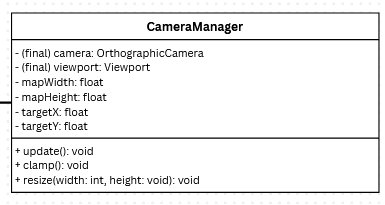
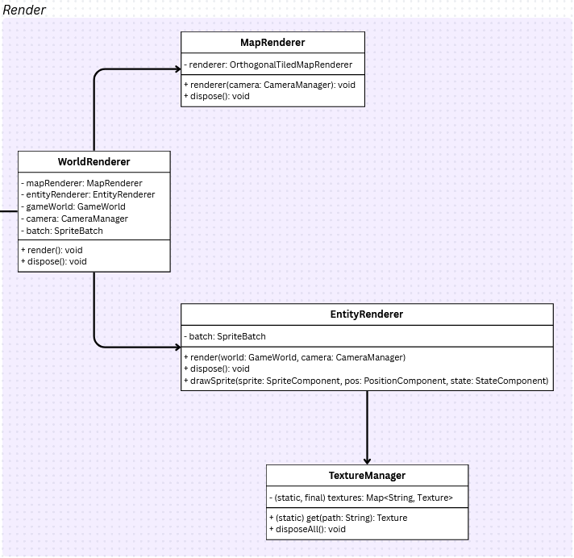

<h2>Game engine for Platformer</h2>

\> [Home](../../../README.md)

\> Previous : [*Model*](./model.md)

### Architecture : *View*

#### The game screen

The view part will allow us to display our entities on the screen. To create a screen we need the GameScreen class.

This class will manage the camera and call the render classes. It orders the view part of the game engine.

#### The camera

When the screen is created, the player need to see his character. The role of the camera is to follow the player, then the background will move, and the character too.  

#### The world renderer

The render system is separated into two classes: the map renderer, and the entity renderer.
It allows the engine to render clearly the whole game world.

\> Next : [*Controller*](./controller.md)
