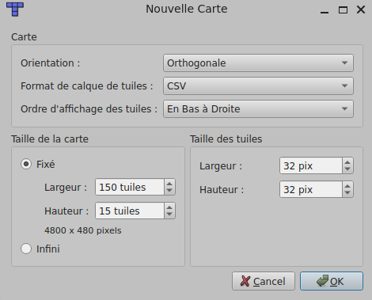

<h2>Game engine for Platformer</h2>

\> [Home](../../../README.md)

\> Previous : [*Resources*](./assets.md)

### Documentation : *Add a new map*

To be functional, these steps must be followed:

### 1. Creating the project in Tiled
Before drawing, the file must be configured according to the engine's standards:
* **Orientation**: Choose **Orthogonal** mode.
* **Grid Size**: Tiles must be exactly **32x32 pixels**.
* **Map Size**: Width: 150 tiles, Height: 15 tiles.
* 

### 2. Tile Layer: `Sol`
This layer contains the visual elements of the environment on which entities can walk.
* **Layer Name**: Must be exactly `Sol`.
* **Physics**: For the engine to generate collisions on this layer:
    * Go to the Tileset editor in Tiled.
    * Select the collision editor.
    * Add the collision class **`Sol`** to them.
    * The `MapLoader` will read this class to create the collision boxes.

### 3. Object Layer: `Objects`
Each object must be named correctly to be interpreted:

| Object Name | Tiled Type | Role in the engine |
| :--- | :--- | :--- |
| **`Start`** | Rectangle | Defines the player's spawn. |
| **`End`** | Rectangle | End Zone. Triggers the transition to the next level via the `LevelManager`. |
| **`Wall`** | Rectangle | Invisible wall placed at the left and right ends to block the camera and the player. |

### 4. To add the level
1. Create a `levelX.tmx` file in `assets/maps/` respecting the nomenclature above.
2. Create a Java class `LevelX` inheriting from `Level`.
3. Add it to the level list in the `LevelManager`.

\> Next : [*End*](../../../README.md)
